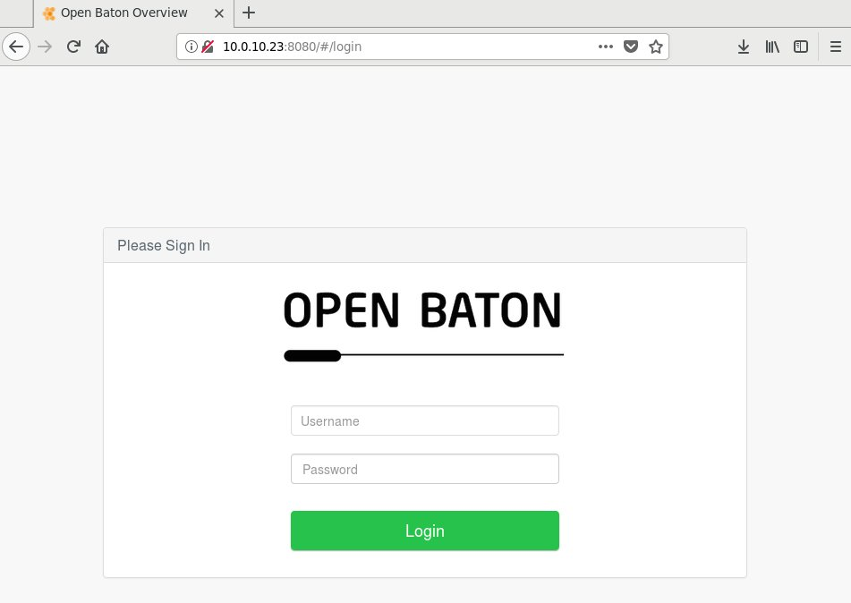
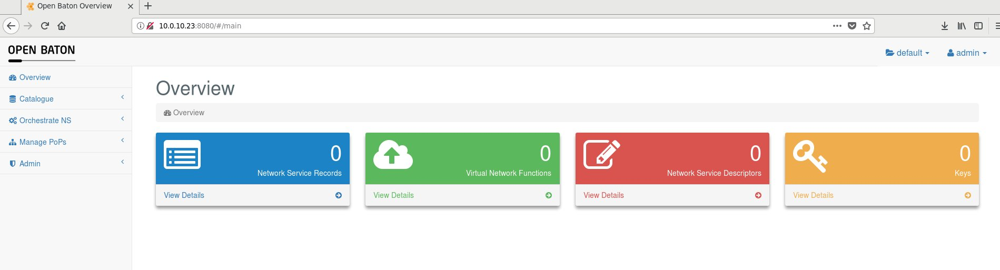
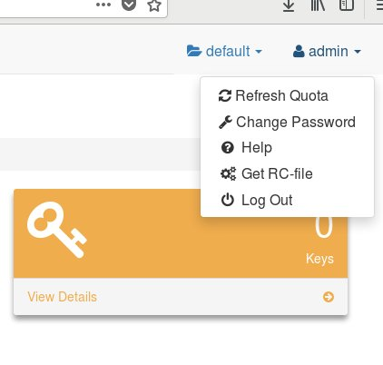

# OpenBaton Workshop

In this lab the OpenBaton Managmenet and Orchestration (MANO) system will be installed into a Linux virtual machine.

## About this Repository

The `bootstrap-config-file` and `bootstrap.sh` file were borrowed from the official OpenBaton [installation documentation](https://openbaton.github.io/documentation/nfvo-installation-deb/) for Linux. They are only kept in this repository so that a known working copy of a particular version of the installation and configuration files is used. For non-workshop use, the official installation or a form of it should be used.

## Installation

### Create a Virtual Machine

First, create a virtual machine with at least 8GB of memory and 10GB of disk. The example below shows the creation of an OpenStack virtual machine. However, note that this virtual machine could exist in any virtualization infrastructure, for example Amazon Web Services, OpenStack, a local VMWare instance...anywhere a VM can be created that has access to the Internet to obtain packages. It's just an example.

*NOTE: In this example the `openbaton.flavor` would have the appropirate resources or sizing to run a small all in one OpenBaton node.*

```
openstack server create \
--key-name default  \
--flavor openbaton.flavor \
--nic net-id=openbaton-network \
--image xenial openbaton
```

### Clone this Repository

Once the virtual machine has been created, ssh into it and clone this repository.

*NOTE: For the purposes of this workshop, any commands that show the `ubuntu@openbaton` prompt are meant to be run from the virtual machine in which OpenBaton will be installed.*

```
ubuntu@openbaton:~$ git clone https://github.com/idx-labs/nfv-mano-workshop.git
```

Change directories into `nfv-mano-workshop/lab0`.

```
ubuntu@openbaton:~$ cd ~/nfv-mano-workshop/lab0
```

## Install OpenBaton

From the `lab0` directory, use the `bootstrap.sh` script to install OpenBaton.

First, setup a screen session. (This is just in case the network connection to your VM fails for some reason. With screen it's easy to reconnect to the bash session that is running the installation.)

The command starts a screen session with the name of `install`.

```
ubuntu@openbaton:~$ screen -R install
```

If screen is not installed, then install it and run the above command.

```
ubuntu@openbaton:~$ apt install screen -y
```

From that screen session run the bootstrap script.

```
ubuntu@openbaton:~$ cd nfv-mano-workshop/lab0
ubuntu@openbaton2:~/nfv-mano-workshop/lab0$ ./bootstrap.sh release --config-file=`pwd`/bootstrap-config-file
```
## Access the OpenBaton Web Interface

To access the OpenBaton web interface it will be necessary to connect to the IP of the virtual machine, either directly or via something like a floating IP. In this example, the connection is direct and the browser instance can connect to the IP address of the virtual machine.

*NOTE: If you are participating in this workshop in a classroom environment, access details will be provided to you.*

Note the the web server is running on port `8080`. Below we can see that, in this particular example, the VM has an IP address of 10.0.10.23.



Login with the username of `admin` with a password of `openbaton`.

```
username: admin
password: openbaton
```

Below is an image of the web interface once logged in.



## Setup Command Line Access

Login to the OpenBaton web interface.

Then, click the far most right link, the `admin` link, and select `Get RC-File`.



Save the file locally then open it up in a text editor.

Copy the text into a file on the OpenBaton virtual machine and call it `openbatonrc`. The file should look something like the below. The `PROJECT_ID` will likely be the only difference.

```
ubuntu@openbaton:~$ cat ~/openbatonrc
#!/bin/bash

unset OB_NFVO_IP
unset OB_NFVO_PORT
unset OB_PROJECT_ID
unset OB_USERNAME
unset OB_PASSWORD

export OB_NFVO_IP=localhost
export OB_NFVO_PORT=8080
export OB_PROJECT_ID=6e02d433-597f-40b1-ae0a-501dc30a019f
export OB_USERNAME=admin
export OB_PASSWORD=openbaton
```

Next, source that file.

```
ubuntu@openbaton:~$ . ~/openbatonrc
```

With the variables in that file sourced into the current bash session, the OpenBaton command line interface can be used.

```
ubuntu@openbaton:~$ openbaton project list

+--------------------------------------+---------+-----------------+
| id                                   | name    | description     |
+======================================+=========+=================+
| 6e02d433-597f-40b1-ae0a-501dc30a019f | default | default project |
+--------------------------------------+---------+-----------------+
```

## Install Completed

At this point the initial installation of OpenBaton has been completed. With a working OpenBaton installation, further labs may be completed.

## Troubleshooting

### Restarting OpenBaton After a Reboot

```
ubuntu@openbaton:~$ sudo systemctl start openbaton-nfvo.service
ubuntu@openbaton:~$ sudo systemctl start openbaton-vnfm-generic.service
```
